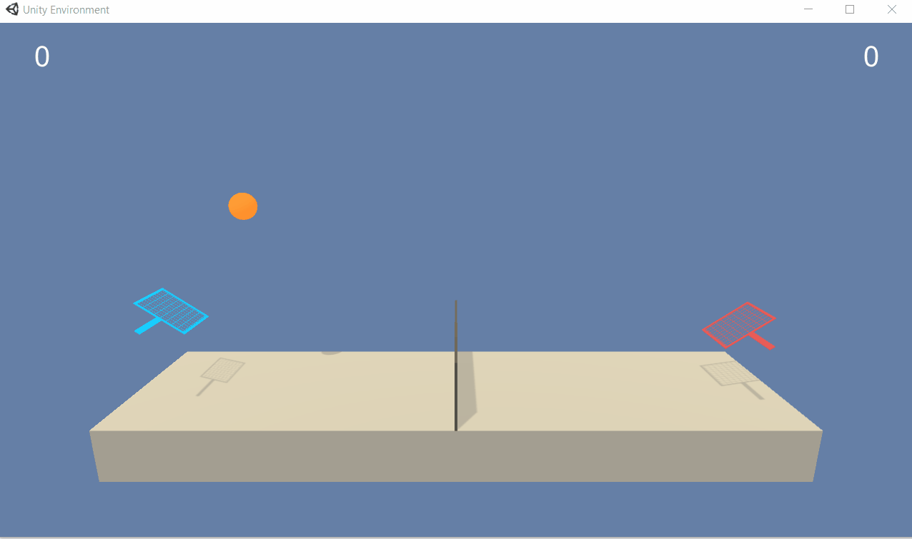

# Project 3: Collaboration and Competition

### Introduction

The goal of this project was to train two agents learning to play in [Tennis](https://github.com/Unity-Technologies/ml-agents/blob/master/docs/Learning-Environment-Examples.md#tennis) environment.

In this environment, two agents control rackets to bounce a ball over a net. If an agent hits the ball over the net, it receives a reward of +0.1.  If an agent lets a ball hit the ground or hits the ball out of bounds, it receives a reward of -0.01.  Thus, the goal of each agent is to keep the ball in play.

The observation space consists of 8 variables corresponding to the position and velocity of the ball and racket. Each agent receives its own, local observation.  Two continuous actions are available, corresponding to movement toward (or away from) the net, and jumping. 

The task is episodic, and in order to solve the environment, the agents must get an average score of +0.5 (over 100 consecutive episodes, after taking the maximum over both agents). Specifically,

- After each episode, we add up the rewards that each agent received (without discounting), to get a score for each agent. This yields 2 (potentially different) scores. We then take the maximum of these 2 scores.
- This yields a single **score** for each episode.

The environment is considered solved, when the average (over 100 episodes) of those **scores** is at least +0.5.

### Getting Started

1. I have already provided the 64 bit Windows version in my repository, but if yours is different then download the environment from one of the links below.  You need only select the environment that matches your operating system:
    - Linux: [click here](https://s3-us-west-1.amazonaws.com/udacity-drlnd/P3/Tennis/Tennis_Linux.zip)
    - Mac OSX: [click here](https://s3-us-west-1.amazonaws.com/udacity-drlnd/P3/Tennis/Tennis.app.zip)
    - Windows (32-bit): [click here](https://s3-us-west-1.amazonaws.com/udacity-drlnd/P3/Tennis/Tennis_Windows_x86.zip)
    - Windows (64-bit): [click here](https://s3-us-west-1.amazonaws.com/udacity-drlnd/P3/Tennis/Tennis_Windows_x86_64.zip)
    
    (_For Windows users_) Check out [this link](https://support.microsoft.com/en-us/help/827218/how-to-determine-whether-a-computer-is-running-a-32-bit-version-or-64) if you need help with determining if your computer is running a 32-bit version or 64-bit version of the Windows operating system.

    (_For AWS_) If you'd like to train the agent on AWS (and have not [enabled a virtual screen](https://github.com/Unity-Technologies/ml-agents/blob/master/docs/Training-on-Amazon-Web-Service.md)), then please use [this link](https://s3-us-west-1.amazonaws.com/udacity-drlnd/P3/Tennis/Tennis_Linux_NoVis.zip) to obtain the "headless" version of the environment.  You will **not** be able to watch the agent without enabling a virtual screen, but you will be able to train the agent.  (_To watch the agent, you should follow the instructions to [enable a virtual screen](https://github.com/Unity-Technologies/ml-agents/blob/master/docs/Training-on-Amazon-Web-Service.md), and then download the environment for the **Linux** operating system above._)

2. Place the file in the  repository, and unzip (or decompress) the file. 

3. You will need to install unity agents for loading the environment. Note for this you will need Python 3.6.1 since with newer versions the required pytorch versions are not available.
    Once you have the right python version you can just run.
    ```
    pip install ./python
    ```
    This will install the required libraries


### Instructions

If you wish to trian you own agent, then you simply need to run `python train.py` and it will start training a model. The `agent.py` file contains the `Agent` class, `buffer.py` contains `ReplayBuffer`, `noise.py` got `OUNoise`, `model.py` got the network classes. However if you wish to load in the the trained agent and visualise it, you may run the following:

```
from unityagents import UnityEnvironment
from agent import Agent
import torch
import numpy as np
from collections import deque
from matplotlib import pyplot as plt
env = UnityEnvironment(file_name='Tennis/Tennis.exe') 
brain_name = env.brain_names[0]
brain = env.brains[brain_name]
env_info = env.reset(train_mode=False)[brain_name] # set False if you wish to visualize the environment
action_size = brain.vector_action_space_size
states = env_info.vector_observations
state_size = states.shape[1]
agents = [Agent(state_size, action_size, 0),Agent(state_size, action_size, 0)]
agents[0].network.actor.load_state_dict(torch.load("actor_0_solution.pth"))
agents[1].network.actor.load_state_dict(torch.load("actor_1_solution.pth"))
env_info = env.reset(train_mode=False)[brain_name]
score = np.zeros(2)
for t in range(1000):
    actions = [agents[0].act(torch.from_numpy(env_info.vector_observations[0]).float(), add_noise=False),
               agents[1].act(torch.from_numpy(env_info.vector_observations[1]).float(), add_noise=False)]
    env_info = env.step(actions)[brain_name]
    score += env_info.rewards
print("Final score:", np.max(score))
```

The above code keeps the environment running for 1000 timestep. I have kept noise off, so it will take the optimum action
determined by the model.

You can use the `actor_0_solution.pth`, `actor_1_solution.pth`, `critic_0_solution.pth`, `critic_1_solution.pth` to further train 
the model as well. 

### Performance

Here is a clip of the trained agents playing the game:


I also tried to run the agents by swapping their parameters, and the performance was still good:




### Problems and Improvement

Well the first bitter taste in my mouth is not fully utilising the concepts from the MADDPG paper. I do wanna try more on the network architecture to see if we can have a better performing model by providing more information. Also above when visualizing I noticed in a lot of the scenarios, the agents made a lot of unnecessary movements. While this was not part of the goal at all, but I think it would be nice to see more cleaner moves. Maybe further training could help improve this, but I think by sharing both states to the model, this could possibly also pick up on this. Because from the state if the agent can understand it is not the one receiving the ball, it does not need to move up and down again and again.

Secondly, I am not very happy about the number of episodes it took to learn, I think this could be improved a lot by using Prioritized Experience Replay. At the moment both agent refer to a single instance of memory, but they use their own experiences, but I think in this case we could train the agent with each others expereince as well, as in most cases it should be quite similar. I have tried swapping the parameters for agents and it still performed well, which supports this idea of mine I think.

I am also curisous to see if changing the optimzier would make any difference, as in both cases I used Adam and through the whole trial and error process I never changed it. So I would like to see if this would make any difference in the progresss.

Once again, I think it might help to have a network to extrapolate features from the state and then feed that into the actor and critic network. This might help the agents to pick on more info, and features network could be a single network shared with both agents. I think this would also help a lot if we were to share the memory.

Another interesting thing to try could be is using different network architecture for different agents. While in this case it shouldn't help significantly as both agent have the same goal and reward system, but it would still be interesting to see if it can make a difference.

The last thing I sort of wanna mention, is that I see the agents sort of repeating the same action that keeps the ball on air and in boundary, but which is kind of boring. It might be more interesting to make the agent try to score against the other, so here I think it will be good if the reward system was slightly changed. So it could be something simpler, if agent misses the ball or out of boundary -0.1, and if it scores against +0.1. 